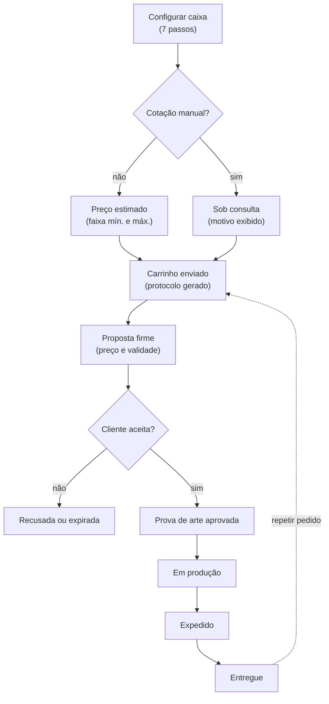

# Especificação — Sistema de Pedidos Atto Embalagens

06/10/2026 · João Pedro

O sistema proposto é um portal B2B no qual o cliente configura caixas de papelão ondulado, recebe uma estimativa de preço ou pede uma cotação, e acompanha o pedido até a entrega. Tudo o que não foi confirmado sobre a Atto aparece marcado como **\[LACUNA\]** e deve ser validado com a empresa antes do desenvolvimento.

## 0. Análise da Atto Embalagens

O site attoembalagens.com.br estava bloqueado na rede do ambiente onde este documento foi escrito. Por isso, os fatos abaixo vêm de resultados de busca que citam o site (páginas inicial e "Sobre nós") e de cadastros públicos de CNPJ. Nenhum dado de preço, prazo ou catálogo foi inventado.

### Fatos confirmados

| Item | O que se sabe | Fonte |
| --- | --- | --- |
| Empresa | Atto Indústria e Comércio de Embalagens LTDA, CNPJ 17.041.177/0001-39, fundada em 22/10/2012 | [Econodata](https://www.econodata.com.br/consulta-empresa/17041177000139-ATTO-INDUSTRIA-E-COMERCIO-DE-EMBALAGENS-LTDA) |
| Localização | Rua das Magnólias, 111, Parque Oeste Industrial, Goiânia/GO, CEP 74375-280 | [Diário Cidade](https://www.diariocidade.com/go/goiania/guia/atto-embalagens-17041177000139/) |
| Contato | (62) 3928-9599 e (62) 3928-9600 | Busca no site [attoembalagens.com.br](https://attoembalagens.com.br/) |
| Posicionamento | Une 20 anos de experiência comercial em papelão ondulado para oferecer "atendimento diferenciado e exclusivo para cada cliente" | Página [Sobre nós](https://attoembalagens.com.br/sobre-nos/) |
| Produto | Embalagens em papelão ondulado, impressas em flexografia com até 3 cores | Busca no site |
| Fábrica | Parque fabril de 5 mil m², com máquinas novas que automatizam grande parte do processo | Busca no site |
| Segmentos | Indústria alimentícia, automotiva, têxtil e de autopeças | Busca no site |
| Área de entrega | Goiás, Distrito Federal e outros estados | Busca no site |

### Lacunas que afetam o sistema

| Lacuna | Onde afeta o sistema | Como o sistema trata até ser validada |
| --- | --- | --- |
| \[LACUNA\] Catálogo de modelos de caixa (ex.: códigos FEFCO 0201 maleta, 0427 corte e vinco) | Configurador, passo 1 | Catálogo cadastrável pelo admin; o MVP sugere 3 modelos padrão |
| \[LACUNA\] Ondas disponíveis (B, C, BC, E) e gramaturas, ECT ou resistência de coluna | Configurador, passo 3 e estimativa | Tabela de composições editável |
| \[LACUNA\] Papel de capa (kraft pardo ou branco) | Configurador e preço | Opção ativada ou desativada pelo admin |
| \[LACUNA\] Acabamentos (verniz, laminação, janela, alça, divisória) | Configurador, passo 5 | Por padrão, todo acabamento leva a cotação manual |
| \[LACUNA\] Pedido mínimo e lote econômico | Validação de quantidade | Parâmetro `qtd_minima` por modelo |
| \[LACUNA\] Prazos de produção | Estimativa de prazo e status | Prazo exibido como "a confirmar" até haver parâmetro |
| \[LACUNA\] Custos, preços por m² e margens | Motor de estimativa | Nenhum valor no código; tudo vem do painel admin |
| \[LACUNA\] Política de frete e cidades atendidas | Resumo do pedido | Frete "a calcular pela equipe comercial" |
| \[LACUNA\] Pagamento e crédito (boleto, prazo, Pix, análise de crédito) | Checkout e financeiro | Pedido fechado fora do sistema no MVP |
| \[LACUNA\] ERP usado pela Atto | Integrações | Exportação CSV ou API genérica no MVP |
| \[LACUNA\] WhatsApp e e-mail comercial | Contato e notificações | Campos configuráveis |
| \[LACUNA\] Certificações (FSC, ISO) | Conteúdo institucional | Não exibir até confirmar |
| \[LACUNA\] Atende e-commerce, varejo e pequenos volumes? | Personas e pedido mínimo | Tratado como hipótese |

### Necessidades do cliente B2B

- **Velocidade:** saber quanto custa sem esperar dias por um retorno do comercial.
- **Clareza técnica:** muitos compradores não sabem qual onda ou resistência escolher e precisam de ajuda guiada.
- **Recompra sem atrito:** a maior parte do volume B2B é repetição da mesma caixa; refazer a especificação a cada pedido é desperdício.
- **Padronização:** guardar as especificações aprovadas ("minhas embalagens") para evitar erros de medida ou de arte.
- **Aprovação de arte:** enviar o arquivo, receber a prova e aprovar com registro.
- **Previsibilidade:** ver em que etapa o pedido está e quando chega.
- **Contato humano:** o diferencial declarado da Atto é o atendimento exclusivo, então o sistema deve aproximar o cliente do vendedor, não substituí-lo.

## 1. Visão geral do sistema

**Atto Online** é um web app responsivo em que empresas configuram caixas de papelão ondulado sob medida, recebem uma estimativa de preço na hora ou pedem uma cotação personalizada, e acompanham orçamentos e pedidos num painel próprio. A equipe comercial da Atto usa um backoffice para responder cotações, aprovar artes e atualizar status.

**Proposta de valor**

- Para o cliente: orçamento em minutos, recompra em 3 cliques e visibilidade do pedido.
- Para a Atto: pedidos chegam com a especificação completa e padronizada, o comercial gasta menos tempo coletando medidas e mais tempo negociando, e cada cotação vira dado para entender a demanda.

**Escopo**

| Módulo | O que cobre |
| --- | --- |
| Portal do cliente | Cadastro PJ, configurador, estimativa, carrinho, envio de arte, pedidos, histórico, recompra, mensagens |
| Motor de estimativa | Cálculo de área de chapa, custo por composição, impressão, ferramental e escala, com regras de quando exigir cotação manual |
| Backoffice comercial | Fila de cotações, ajuste de preço, aprovação de arte, status de produção, clientes, parâmetros de preço e catálogo, relatórios |
| Notificações | E-mail no MVP; WhatsApp e push depois |

**Fora de escopo no MVP:** pagamento online, emissão de nota fiscal, controle de produção (PCP) e estoque. Esses pontos ficam no ERP da Atto \[LACUNA: qual ERP\].

**Princípio central: estimativa não é cotação.** O sistema mostra três níveis de preço, sempre rotulados:

| Nível | Quando aparece | Rótulo na tela |
| --- | --- | --- |
| Estimativa automática | Configuração dentro dos limites padrão | "Estimativa: R$ X a R$ Y por unidade. Valor sujeito a confirmação." |
| Cotação sob consulta | Configuração fora dos limites (modelo especial, acabamento, quantidade atípica) | "Este item precisa de cotação personalizada. Resposta em até N horas úteis." |
| Proposta firme | Cotação revisada e enviada pelo comercial | "Proposta válida até dd/mm/aaaa" |

## 2. Personas

Os segmentos citados pela Atto (alimentício, automotivo, têxtil e autopeças) sugerem um público majoritariamente industrial. As personas de PME e e-commerce são hipóteses \[LACUNA\] a confirmar com o comercial.

| Persona | Quem é | Objetivo | Dores | O que o sistema oferece |
| --- | --- | --- | --- | --- |
| **Carlos, comprador industrial** | Compras de indústria alimentícia ou de autopeças; compra a mesma caixa todo mês | Repor estoque rápido, com preço e prazo previsíveis | Liga, manda e-mail e espera retorno para repetir um pedido igual ao anterior | "Minhas embalagens", repetir pedido, histórico de preços |
| **Juliana, analista de logística** | Expedição e armazenagem; define medidas e resistência | Caixa certa para o produto e o empilhamento | Não sabe traduzir peso e empilhamento em onda e gramatura | Assistente técnico, medidas internas, alertas de resistência |
| **Rafael, dono de PME ou e-commerce** (hipótese) | Primeira compra de caixa personalizada | Caixa com a marca dele, sem complicação | Não conhece os termos técnicos e tem medo do pedido mínimo | Configurador guiado, preço "a partir de", glossário |
| **Bianca, designer ou marketing** | Cuida da arte impressa | Arte correta na faca certa | Recebe a faca por e-mail e a prova chega em PDF solto | Download do gabarito, upload, aprovação de prova com comentários |
| **Marcos, vendedor interno da Atto** | Atende a carteira de clientes | Responder rápido e fechar mais | Gasta tempo coletando dados incompletos | Fila de cotações com especificação completa e editor de proposta |
| **Patrícia, PCP ou gerente comercial da Atto** | Planeja produção e define preços | Margem saudável e carga de máquina previsível | Preços inconsistentes entre vendedores | Tabela de parâmetros central, relatórios, aprovação de descontos |

## 3. Jornada do cliente

A jornada tem 9 etapas. As etapas 2 a 5 são onde o sistema mais encurta o caminho atual (telefone e e-mail), e a etapa 9 é onde está a maior parte do volume recorrente.

| # | Etapa | O que o cliente faz | Dor hoje (provável) | Como o sistema resolve | Toque humano |
| --- | --- | --- | --- | --- | --- |
| 1 | Descoberta | Chega pelo site, Google ou indicação | Não sabe se a Atto atende o volume dele | Landing com segmentos, "orçamento em minutos" e pedido mínimo \[LACUNA\] visível | — |
| 2 | Cadastro | Cria conta com CNPJ | Formulários longos | CNPJ preenche razão social e endereço; pode configurar antes de se cadastrar | — |
| 3 | Configuração | Escolhe modelo, medidas, material, impressão e quantidade | Não domina os termos técnicos | Wizard com prévia, ajuda contextual e recomendação de onda | Botão "falar com especialista" em todo passo |
| 4 | Estimativa | Vê a faixa de preço e o efeito da quantidade | Espera dias por um número | Preço na hora ou aviso claro de cotação manual | — |
| 5 | Arte | Baixa o gabarito e envia o arquivo | Troca de e-mails sobre faca e cores | Upload com checagem automática de formato | Pré-impressão confere a arte |
| 6 | Solicitação | Envia o carrinho como pedido de cotação | Não sabe se o pedido chegou | Protocolo, e-mail de confirmação e prazo de resposta | Vendedor revisa e envia proposta firme |
| 7 | Aprovação | Aceita a proposta e aprova a prova digital | Aprovação por e-mail sem registro | Aceite com registro de usuário, data e IP | Comercial confirma condições de pagamento |
| 8 | Produção e entrega | Acompanha o status | Liga para saber onde está | Linha do tempo com notificações em cada mudança | PCP atualiza o status |
| 9 | Recompra | Repete o pedido | Refaz toda a especificação | "Repetir pedido" com a mesma especificação e arte aprovada | — |

## 4. Funcionalidades

São 15 funcionalidades. Cada uma tem um objetivo e uma descrição de como funciona na prática; a fase entre parênteses no título indica se entra no MVP.

### 4.1 Cadastro e login de empresa (MVP)

**Objetivo:** identificar a empresa compradora e permitir vários usuários por CNPJ.

**Na prática:** o usuário informa o CNPJ e o sistema consulta a razão social, o endereço e a situação cadastral numa API pública. Ele completa nome, e-mail corporativo, telefone e senha e confirma o e-mail por link. O primeiro usuário vira administrador da conta e convida colegas com papéis (comprador, aprovador, designer). O login aceita e-mail e senha ou link mágico; a recuperação de senha é por e-mail. CNPJ inativo bloqueia o cadastro e avisa o comercial.

### 4.2 Configurador de caixa (MVP)

**Objetivo:** coletar uma especificação completa e fabricável sem que o cliente precise dominar termos técnicos.

**Na prática:** um wizard de 7 passos (detalhado na seção 5) com prévia visual da caixa que se atualiza a cada medida. Cada campo tem ajuda ("o que é onda dupla?") e validação imediata. Opções que a Atto não oferece não aparecem, pois o catálogo vem do painel admin. O cliente pode salvar um rascunho e voltar depois.

### 4.3 Assistente de resistência (fase 2)

**Objetivo:** ajudar quem não sabe qual papelão escolher.

**Na prática:** o cliente responde 3 perguntas (peso do conteúdo, quantas caixas empilhadas, se é armazenagem refrigerada ou úmida) e o sistema sugere a composição com base numa tabela de regras definida pela engenharia da Atto \[LACUNA: critérios técnicos\]. A sugestão é sempre editável e traz o aviso de que não substitui um teste de compressão.

### 4.4 Estimativa de orçamento (MVP)

**Objetivo:** dar um preço de referência imediato, sem prometer o que só o comercial pode confirmar.

**Na prática:** ao fim do configurador aparece o preço unitário e o total em faixa (mínimo e máximo), uma tabela com 3 quantidades alternativas ("com 2.000 unidades o unitário cai para R$ Y") e o aviso fixo de que é uma estimativa. Se alguma regra da seção 6 disparar, o preço não é exibido e o item vira "cotação sob consulta", com o motivo explicado.

### 4.5 Envio de arquivos de arte (MVP)

**Objetivo:** receber a arte certa, no formato certo, ligada ao item certo.

**Na prática:** no passo de impressão, o cliente baixa o gabarito da faca em PDF gerado com as medidas dele (fase 2; no MVP, o gabarito é enviado pelo comercial). Depois envia PDF, AI, EPS, SVG, CDR, PNG ou JPG de até 100 MB. O sistema checa extensão, tamanho e resolução mínima de imagens e avisa sobre fontes não convertidas quando consegue detectar. Cada arquivo tem versões (v1, v2...) e fica no item do pedido.

### 4.6 Aprovação de prova digital (MVP)

**Objetivo:** registrar formalmente que o cliente aprovou a arte final antes da gravação do clichê.

**Na prática:** a pré-impressão da Atto sobe a prova em PDF. O cliente recebe um e-mail, abre a prova no portal e clica em "Aprovar" ou "Pedir ajuste" com comentário. A aprovação guarda usuário, data, hora e IP e libera o pedido para produção.

### 4.7 Carrinho e resumo do pedido (MVP)

**Objetivo:** reunir vários itens numa única solicitação e revisar tudo antes de enviar.

**Na prática:** cada caixa configurada vira um item com miniatura, especificação resumida, quantidade, preço estimado ou "sob consulta" e arte anexada. O resumo mostra endereço de entrega, CNPJ de faturamento, observações, data desejada e frete "a calcular" \[LACUNA: política de frete\]. O botão principal é "Solicitar cotação", não "Comprar", porque o preço final é confirmado pelo comercial.

### 4.8 Solicitação de cotação e proposta firme (MVP)

**Objetivo:** transformar o carrinho num processo comercial rastreável.

**Na prática:** ao enviar, o cliente recebe um protocolo (ex.: COT-2026-00123) e um prazo de resposta configurável. O vendedor responsável pela carteira revisa, ajusta o preço e envia uma proposta firme com validade. O cliente aceita no portal; o aceite converte a cotação em pedido. A proposta pode ser baixada em PDF.

### 4.9 Acompanhamento de status (MVP)

**Objetivo:** reduzir ligações de "onde está meu pedido?".

**Na prática:** cada pedido tem uma linha do tempo com os status da seção 5, data e hora de cada mudança e previsão de entrega. No MVP o comercial ou o PCP atualiza o status à mão; na fase 3 a atualização vem do ERP.

### 4.10 Histórico de pedidos e orçamentos (MVP)

**Objetivo:** dar ao cliente a memória de tudo o que comprou e cotou.

**Na prática:** lista filtrável por período, status, produto e usuário, com busca por protocolo. Cada registro abre a especificação completa, os arquivos, as propostas e as mensagens. A lista pode ser exportada em CSV.

### 4.11 Repetir pedido e "Minhas embalagens" (MVP)

**Objetivo:** fazer a recompra em segundos.

**Na prática:** toda especificação que já virou pedido fica salva em "Minhas embalagens" com nome (ex.: "Caixa biscoito 400 g"), a arte aprovada e o último preço pago. "Repetir pedido" copia os itens para um novo carrinho; o cliente só ajusta a quantidade. Se a arte ou a medida mudar, o sistema trata o item como novo e pede nova aprovação. O preço é recalculado e o sistema avisa se mudou em relação ao último pedido.

### 4.12 Notificações (MVP por e-mail)

**Objetivo:** avisar sobre eventos que pedem ação ou acompanhamento.

**Na prática:** e-mail nos eventos de cotação recebida, proposta enviada, proposta perto de vencer (48 h antes), prova para aprovação, mudança de status, pedido expedido e nova mensagem. Também há um sino de notificações no portal. Cada usuário escolhe o que recebe. WhatsApp e push entram na fase 2.

### 4.13 Contato com a equipe comercial (MVP)

**Objetivo:** manter o atendimento próximo, que é o diferencial declarado da Atto.

**Na prática:** cada cotação e pedido tem um chat em formato de thread com o vendedor responsável, com anexos. Um botão fixo "Falar com especialista" abre o WhatsApp comercial \[LACUNA: número\] com uma mensagem pronta que contém o protocolo. O cliente vê o nome e a foto do vendedor da carteira dele.

### 4.14 Gestão de usuários e endereços da empresa (MVP)

**Objetivo:** atender empresas com várias pessoas e vários locais de entrega.

**Na prática:** o admin da conta convida usuários, define papéis e limites (ex.: comprador cria cotações e aprovador aceita propostas), cadastra vários endereços de entrega e define o padrão.

### 4.15 Documentos financeiros (fase 3)

**Objetivo:** concentrar notas fiscais e boletos num só lugar.

**Na prática:** quando a integração com o ERP existir, cada pedido mostra o XML e o PDF da NF-e, os boletos e a situação de pagamento.

## 5. Fluxo de criação de pedido

O pedido nasce num configurador de 7 passos, passa por uma decisão automática (estimativa ou cotação manual) e só vira pedido de produção depois de dois aceites do cliente: o da proposta firme e o da prova de arte.

### 5.1 Passos do configurador

| Passo | O cliente informa | Validações | Ajuda na tela |
| --- | --- | --- | --- |
| 1. Modelo | Tipo de caixa: maleta (FEFCO 0201), meia maleta (0200), corte e vinco, tampa e fundo, ou "outro: descreva" \[LACUNA: catálogo real\] | Obrigatório | Ilustração de cada modelo e usos típicos |
| 2. Medidas | Comprimento, largura e altura **internas** em mm ou cm; peso do conteúdo (opcional) | Faixas mínima e máxima por modelo \[LACUNA: limites de máquina\]; C ≥ L para maleta | Desenho explicando medida interna; prévia em escala |
| 3. Material | Onda (simples ou dupla, ex.: B, C, BC), papel de capa (kraft ou branco), resistência \[LACUNA: opções reais\] | Combinações inválidas bloqueadas | Assistente de resistência (fase 2); glossário |
| 4. Impressão | Sem impressão, ou 1 a 3 cores em flexografia; faces impressas; cores (Pantone ou referência) | Máximo de 3 cores, que é o limite citado pela Atto; acima disso, cotação manual | Exemplo de 1, 2 e 3 cores; aviso de que flexografia não é fotográfica |
| 5. Acabamento e extras | Verniz, janela, alça, divisória, fechamento (cola, grampo, fita) \[LACUNA: o que a Atto faz\] | Acabamento especial leva a cotação manual | Foto de cada opção |
| 6. Quantidade | Quantidade e data desejada | ≥ pedido mínimo \[LACUNA\]; múltiplos de amarrado \[LACUNA\] | Tabela de preço por faixa de quantidade |
| 7. Arte e revisão | Upload da arte (ou "enviar depois"), nome do item, observações | Formato e tamanho do arquivo | Resumo completo, estimativa e prévia |

O cliente pode voltar a qualquer passo sem perder dados. O rascunho é salvo a cada passo.

### 5.2 Decisão de preço

Ao fim do passo 7, o motor da seção 6 roda. Se nenhuma regra de cotação manual disparar, o item entra no carrinho com estimativa. Se alguma disparar, entra como "sob consulta" com o motivo visível. Os dois tipos podem ficar no mesmo carrinho.



Os itens estimados e os itens sob consulta se juntam no mesmo carrinho. A recompra (linha pontilhada) volta direto ao carrinho com a especificação e a arte já aprovadas.

### 5.3 Estados da cotação e do pedido

| Estado | Quem muda | Significado |
| --- | --- | --- |
| Rascunho | Cliente | Carrinho ainda não enviado |
| Cotação solicitada | Cliente | Enviada; protocolo gerado |
| Em análise | Comercial | Vendedor assumiu |
| Proposta enviada | Comercial | Preço firme com validade |
| Proposta aceita / recusada / expirada | Cliente ou sistema | Aceite gera o pedido; expiração é automática |
| Aguardando arte | Sistema | Pedido sem arte final |
| Prova enviada | Pré-impressão | Cliente precisa aprovar |
| Arte aprovada | Cliente | Libera para produção |
| Em produção | PCP | Na fábrica |
| Pronto para expedição | PCP | Embalado |
| Expedido | Logística | Saiu, com nota fiscal e transportadora |
| Entregue | Logística ou cliente | Recebido |
| Cancelado | Comercial | Com motivo obrigatório |

Pedido sem impressão pula os estados de arte.

## 6. Regras para cálculo da estimativa

A estimativa é custo de chapa, mais impressão, mais ferramental rateado, mais acabamento, tudo multiplicado pela margem e exibido como faixa. **Todos os valores numéricos são parâmetros do painel admin; nenhum preço real da Atto foi informado \[LACUNA\].** Os números abaixo são só nomes de variáveis.

### 6.1 Área de chapa por unidade

Cada modelo tem uma fórmula de planificação cadastrada. Para a maleta FEFCO 0201, com C, L e A internos em mm:

```math
\text{comprimento da chapa} = 2C + 2L + \text{aba de cola} + 4e
```

```math
\text{largura da chapa} = A + L + 2e
```

```math
\text{área (m}^2) = \frac{(\text{comprimento} + \text{refile}) \times (\text{largura} + \text{refile})}{10^6}
```

Aqui `e` é a folga por espessura da onda, e a aba de cola e o refile são parâmetros por modelo. A engenharia da Atto deve validar as fórmulas e folgas \[LACUNA\].

### 6.2 Custo e preço

```math
C_{chapa} = \text{área} \times \text{preço por m}^2_{\text{composição}} \times (1 + \text{perda})
```

```math
C_{unit} = C_{chapa} + n_{cores} \times C_{cor} + C_{acab} + \frac{C_{clichê} + C_{faca} + C_{setup}}{Q}
```

```math
P_{unit} = C_{unit} \times (1 + \text{margem}) \times f_{escala}(Q)
```

| Variável | O que é | Fonte |
| --- | --- | --- |
| preço por m² da composição | Custo da chapa por onda e papel | Tabela admin \[LACUNA\] |
| perda | Percentual de refugo | Parâmetro global |
| C\_cor | Custo de impressão por cor e por unidade | Tabela admin |
| C\_clichê | Custo de clichê por cor, cobrado uma vez | Tabela admin; isento em recompra com mesma arte |
| C\_faca | Faca de corte e vinco, cobrada uma vez | Só em modelos corte e vinco; isento em recompra |
| C\_setup | Acerto de máquina | Por pedido |
| f\_escala(Q) | Fator por faixa de quantidade | Tabela de faixas |
| margem | Margem padrão ou por cliente | Global ou tabela do cliente |

### 6.3 Exibição em faixa

- O preço aparece como faixa: mínimo = P\_unit × (1 − tolerância) e máximo = P\_unit × (1 + tolerância). A tolerância é configurável (sugestão inicial: 10%, a validar).
- Valores arredondados para R$ 0,01 por unidade e R$ 1 no total.
- Sem frete e com impostos conforme regra fiscal da Atto \[LACUNA: preço com ou sem IPI e ICMS\].
- Validade da estimativa: N dias (parâmetro). Depois disso o item precisa ser recalculado.
- Toda mudança de parâmetro gera uma versão; cada estimativa guarda a versão usada, para auditoria.

### 6.4 Quando exigir cotação manual

O preço automático é ocultado e o item vai como "sob consulta" quando ocorrer qualquer um destes casos:

1. Modelo "outro" ou modelo marcado como especial no catálogo.
2. Medida fora dos limites de máquina do modelo.
3. Mais de 3 cores, impressão de alta cobertura ou cor especial (ex.: metálica).
4. Qualquer acabamento marcado como "sob consulta".
5. Quantidade abaixo do mínimo ou acima do teto automático (ex.: lotes muito grandes que pedem negociação).
6. Composição sem preço cadastrado.
7. Cliente com tabela de preço negociada e marcada como "sempre manual".
8. Observações do cliente com pedido técnico (ex.: certificação, teste de compressão).

### 6.5 Textos obrigatórios

- Na estimativa: "Valor estimado com base nas informações fornecidas. O preço final será confirmado pela equipe comercial após análise técnica e da arte. Não inclui frete."
- Na cotação manual: "Este item tem características que pedem análise da nossa equipe. Você receberá uma proposta em até N horas úteis." e o motivo, como "acabamento especial".
- Na proposta firme: "Proposta válida até dd/mm/aaaa" e as condições de pagamento e entrega.

## 7. Painel do cliente

O painel abre no que pede ação do cliente (propostas a aceitar, provas a aprovar) e dá acesso em um clique à recompra.

| Área | Conteúdo | Ações principais |
| --- | --- | --- |
| Início | Cartões "Pede sua ação" (propostas, provas), pedidos em andamento com status, atalho "Nova caixa" e as 3 embalagens mais compradas | Aceitar proposta, aprovar prova, repetir pedido |
| Orçamentos | Lista de cotações com protocolo, data, itens, valor, status e validade | Ver, aceitar, recusar com motivo, duplicar, baixar PDF |
| Pedidos | Lista e detalhe com linha do tempo, itens, arquivos, nota fiscal (fase 3) e previsão de entrega | Acompanhar, repetir, abrir mensagem |
| Minhas embalagens | Especificações salvas com miniatura, arte aprovada, último preço e data da última compra | Repetir, editar como nova, renomear, arquivar |
| Arquivos | Artes, gabaritos e provas por item, com versões | Baixar, enviar nova versão |
| Mensagens | Threads por cotação ou pedido com o vendedor | Responder, anexar |
| Empresa | Dados do CNPJ, usuários e papéis, endereços de entrega | Convidar, definir papéis, editar endereços |
| Preferências | Notificações por canal e evento, idioma, unidade de medida padrão (mm ou cm) | Ligar e desligar |

**Permissões por papel do cliente**

| Ação | Admin da conta | Comprador | Aprovador | Designer |
| --- | --- | --- | --- | --- |
| Configurar e solicitar cotação | Sim | Sim | Sim | Não |
| Aceitar proposta | Sim | Opcional (limite de valor) | Sim | Não |
| Enviar arte e aprovar prova | Sim | Sim | Sim | Sim |
| Gerenciar usuários e endereços | Sim | Não | Não | Não |

## 8. Painel administrativo e comercial

O backoffice é organizado em torno da fila de cotações, porque o tempo de resposta é o que mais pesa na conversão. A gestão de preços fica restrita a perfis de gerência.

| Módulo | Objetivo | Como funciona |
| --- | --- | --- |
| Fila de cotações | Responder rápido e sem perder pedido | Lista por SLA (verde, amarelo, vermelho), filtro por vendedor, segmento e motivo de cotação manual; distribuição automática pela carteira do cliente |
| Editor de proposta | Transformar a solicitação em preço firme | Mostra a estimativa do motor e o custo detalhado; o vendedor ajusta preço, prazo, condições e validade; desconto acima do limite do vendedor pede aprovação do gerente; gera PDF e envia |
| Pré-impressão | Controlar a arte | Fila de artes recebidas, checklist técnico, upload da prova, histórico de versões e comentários |
| Pedidos (kanban) | Atualizar o status | Colunas por estado da seção 5.3; arrastar muda o status e notifica o cliente; atualização em lote |
| Clientes | Visão 360° da conta | Dados do CNPJ, usuários, vendedor responsável, histórico, embalagens salvas, tabela de preço negociada, observações internas |
| Catálogo | Definir o que o cliente pode configurar | Modelos (fórmula de planificação, limites, imagem), composições, cores, acabamentos e regras de "sob consulta" |
| Parâmetros de preço | Controlar o motor de estimativa | Preço por m², custo por cor, clichê, faca, setup, perda, faixas de escala, margem e tolerância; versionado e com simulador de "e se" |
| Relatórios | Medir o canal | Cotações por período, taxa de conversão, tempo médio de resposta, ticket médio, motivos de recusa, produtos mais pedidos e diferença entre estimativa e preço final |
| Usuários internos | Controlar acessos | Perfis: administrador, gerente comercial, vendedor, pré-impressão, PCP e logística, e leitura |
| Auditoria | Rastrear mudanças | Log de quem mudou preço, status ou parâmetro, quando e de qual valor para qual |
| Configurações | Ajustar o canal | SLA, textos legais, modelos de e-mail, WhatsApp comercial, validade padrão de proposta |

O indicador mais importante para acompanhar desde o início é a diferença entre estimativa e preço final. Se ela passar da tolerância com frequência, os parâmetros precisam de ajuste.

## 9. Estrutura de dados

O modelo tem 20 entidades em PostgreSQL. Toda tabela de cliente carrega `empresa_id` para isolar os dados por empresa. A especificação da caixa é uma entidade própria, reutilizada por orçamentos, pedidos e "Minhas embalagens".

| Entidade | Campos principais | Relacionamentos |
| --- | --- | --- |
| Empresa | id, cnpj (único), razao\_social, nome\_fantasia, segmento, situacao\_cadastral, vendedor\_id, tabela\_preco\_id, criado\_em | tem Usuários, Endereços, Orçamentos e Pedidos |
| Usuario | id, empresa\_id (nulo se interno), nome, email (único), telefone, senha\_hash, papel, mfa\_ativo, ultimo\_login | pertence a Empresa |
| Endereco | id, empresa\_id, tipo (faturamento ou entrega), cep, logradouro, numero, cidade, uf, padrao | pertence a Empresa |
| ModeloCaixa | id, codigo\_fefco, nome, formula\_planificacao (JSON), limites\_mm (JSON), imagem\_url, sob\_consulta, ativo | usado por Especificacao |
| Composicao | id, onda, papel\_capa, gramatura, resistencia, espessura\_mm, ativo | usado por Especificacao e ParametroPreco |
| OpcaoImpressao | id, tipo, max\_cores, ativo | usado por Especificacao |
| Acabamento | id, nome, custo\_tipo, sob\_consulta, ativo | N:N com Especificacao |
| Especificacao | id, empresa\_id, nome, modelo\_id, comprimento\_mm, largura\_mm, altura\_mm, composicao\_id, n\_cores, cores (JSON), faces, acabamentos, arte\_aprovada\_id, hash\_spec | usada por ItemOrcamento e ItemPedido |
| Orcamento | id, protocolo, empresa\_id, usuario\_id, vendedor\_id, status, validade, versao\_parametros, total\_estimado, total\_proposto, motivo\_recusa | tem ItensOrcamento; gera Pedido |
| ItemOrcamento | id, orcamento\_id, especificacao\_id, quantidade, tipo\_preco (estimado, sob consulta, firme), preco\_unit\_min, preco\_unit\_max, preco\_unit\_firme, motivo\_manual | pertence a Orcamento |
| Pedido | id, numero, orcamento\_id, empresa\_id, endereco\_entrega\_id, status, previsao\_entrega, numero\_nf, codigo\_erp | tem ItensPedido e HistoricoStatus |
| ItemPedido | id, pedido\_id, especificacao\_id, quantidade, preco\_unit, arquivo\_arte\_id | pertence a Pedido |
| Arquivo | id, empresa\_id, entidade, entidade\_id, tipo (arte, prova, gabarito, nf), versao, nome, mime, tamanho, storage\_key, hash, enviado\_por | ligado a item ou pedido |
| AprovacaoArte | id, arquivo\_id, usuario\_id, decisao, comentario, ip, data\_hora | pertence a Arquivo |
| HistoricoStatus | id, entidade, entidade\_id, de, para, usuario\_id, data\_hora, observacao | de Orcamento ou Pedido |
| Mensagem | id, entidade, entidade\_id, autor\_id, texto, anexos, lida\_em | thread por Orcamento ou Pedido |
| Notificacao | id, usuario\_id, evento, canal, payload, enviada\_em, lida\_em | pertence a Usuario |
| ParametroPreco | id, versao, chave, composicao\_id (opcional), faixa\_qtd (opcional), valor, vigente\_de, vigente\_ate, criado\_por | versionado; lido pelo motor |
| TabelaPrecoCliente | id, empresa\_id, margem, descontos (JSON), sempre\_manual | pertence a Empresa |
| LogAuditoria | id, usuario\_id, acao, entidade, entidade\_id, antes (JSON), depois (JSON), ip, data\_hora | geral |

**Regras de modelagem**

- `hash_spec` identifica especificações iguais, o que permite reconhecer uma recompra e isentar clichê e faca.
- Orçamento guarda `versao_parametros`, para que se saiba com que tabela a estimativa foi feita.
- Preços em centavos (inteiro) ou `numeric(12,4)`, nunca ponto flutuante.
- Exclusão lógica (`excluido_em`) em entidades com valor histórico.

## 10. Integrações

O MVP precisa só de 4 integrações simples (CNPJ, CEP, e-mail e armazenamento). A integração com o ERP é a mais valiosa, mas depende de saber qual sistema a Atto usa \[LACUNA\].

| Integração | Para quê | Opções | Fase |
| --- | --- | --- | --- |
| Consulta de CNPJ | Preencher cadastro e checar situação | BrasilAPI, ReceitaWS, CNPJá | MVP |
| CEP | Preencher endereço | ViaCEP, BrasilAPI | MVP |
| E-mail transacional | Notificações e convites | Resend, Amazon SES, SendGrid | MVP |
| Armazenamento de arquivos | Artes, provas e gabaritos | Amazon S3, Cloudflare R2 (URLs assinadas) | MVP |
| Antivírus de upload | Varrer arquivos enviados | ClamAV em fila | MVP |
| ERP da Atto | Clientes, pedidos, status de produção, NF-e, boletos | API do ERP \[LACUNA\]; no MVP, exportação CSV ou webhook genérico | Fase 3 |
| WhatsApp | Notificações e atalho de contato | Link wa.me no MVP; WhatsApp Business Cloud API na fase 2 | MVP (link) e fase 2 |
| CRM | Funil comercial | RD Station, Pipedrive, HubSpot \[LACUNA: se a Atto usa\] | Fase 2 |
| Frete | Cotação de transporte | Tabela própria ou transportadoras parceiras \[LACUNA\] | Fase 3 |
| Pagamento | Pix, boleto, cartão corporativo | Asaas, Pagar.me, Mercado Pago | Fase 3 |
| Analytics | Funil do configurador | Google Analytics 4, PostHog | MVP |
| Geração de PDF | Propostas e gabaritos | Biblioteca no servidor (ex.: Playwright ou react-pdf) | MVP |

Toda integração externa passa por uma camada de adaptadores com fila e novas tentativas, para que a queda de um serviço não trave o pedido.

## 11. Requisitos de UX/UI

A interface deve fazer um comprador sem conhecimento técnico chegar a uma estimativa em menos de 3 minutos, e um cliente recorrente repetir um pedido em menos de 30 segundos.

**Princípios**

- **Um assunto por tela:** o configurador mostra um passo por vez, com barra de progresso e resumo lateral fixo (no celular, resumo recolhível no rodapé).
- **Linguagem do cliente primeiro:** "Qual o peso do que vai dentro?" antes de "Qual a gramatura?", com o termo técnico entre parênteses e um glossário.
- **Prévia visual:** desenho 2D da caixa (e planificado) que muda com as medidas; 3D na fase 2.
- **Transparência de preço:** estimativa sempre em faixa, com rótulo "Estimativa" e ícone de informação; nunca preço sem rótulo.
- **Preço vivo:** a faixa no resumo lateral atualiza a cada escolha, mostrando o efeito de cada decisão.
- **Erros que ensinam:** "A altura máxima para este modelo é X mm. Precisa de mais? Peça uma cotação especial."
- **Recompra em destaque:** botão "Repetir" em cartões, listas e e-mails.
- **Humano a um clique:** "Falar com especialista" visível em todas as telas do configurador.

**Requisitos técnicos de interface**

| Requisito | Meta |
| --- | --- |
| Responsivo | Mobile-first; funcional de 360 px a 1920 px |
| Acessibilidade | WCAG 2.1 AA: contraste 4,5:1, navegação por teclado, rótulos em todos os campos, foco visível |
| Desempenho | LCP < 2,5 s em 4G; recálculo de estimativa < 300 ms |
| Unidades | mm e cm alternáveis; moeda em R$ com vírgula decimal; datas dd/mm/aaaa |
| Estados | Vazio, carregando, erro e sucesso desenhados para cada lista e formulário |
| Rascunho | Salvo automaticamente a cada passo |
| Idioma | Português do Brasil; estrutura pronta para espanhol |

**Design system**

- Identidade visual da Atto (logo, cores e tipografia) \[LACUNA: manual de marca\].
- Biblioteca de componentes única para portal e backoffice: botões, campos com unidade, seletor visual de modelo (cartões com ilustração), badge de status com cor e texto, linha do tempo, uploader com progresso e cartão de preço com faixa.
- Cores de status sempre acompanhadas de texto, nunca só cor.

## 12. Segurança

Os dois ativos mais sensíveis são a tabela de custos e margens da Atto e as artes dos clientes, que podem ser confidenciais antes de um lançamento. Os controles abaixo protegem os dois e atendem à LGPD.

| Tema | Controle |
| --- | --- |
| Autenticação | Senha com hash Argon2id ou bcrypt; mínimo de 10 caracteres; bloqueio progressivo após tentativas; verificação de e-mail; 2FA opcional para clientes e obrigatório para usuários internos |
| Sessão | Cookie httpOnly, Secure e SameSite; expiração por inatividade; encerrar sessões em outros dispositivos |
| Autorização | Controle por papel (RBAC) e por empresa; toda consulta filtrada por `empresa_id` no servidor; testes automáticos de acesso cruzado entre empresas |
| Proteção de preço | O cliente recebe só o preço final; custos, margens e parâmetros nunca saem do servidor; cálculo apenas no backend; limite de taxa no endpoint de estimativa para impedir que alguém reconstrua a tabela por força bruta |
| Uploads | Lista de extensões e tipos MIME permitidos; tamanho máximo; antivírus; bucket privado; download por URL assinada com validade curta; nunca executar ou renderizar o arquivo no servidor sem isolamento |
| Dados em trânsito e em repouso | HTTPS com TLS 1.2 ou superior e HSTS; banco e storage criptografados; backups diários criptografados com teste de restauração |
| Aplicação | Proteção contra o OWASP Top 10: consultas parametrizadas pelo ORM, CSP, proteção CSRF, validação de entrada com schema, dependências monitoradas |
| Auditoria | Log imutável de mudanças de preço, status, parâmetros, aprovações e acessos administrativos |
| LGPD | Base legal de execução de contrato e legítimo interesse; política de privacidade e termos de uso; consentimento separado para marketing; exportação e exclusão de dados pessoais a pedido; prazo de retenção definido \[LACUNA: política da Atto\]; encarregado (DPO) nomeado |
| Operação | Segredos em cofre (nunca no código); ambientes separados de desenvolvimento, homologação e produção; monitoramento de erros e alertas |

As artes de clientes só são visíveis para a empresa dona e para os perfis internos de comercial e pré-impressão.

## 13. MVP

O MVP entrega o ciclo completo de configurar, estimar, cotar, aprovar e acompanhar, com status atualizado à mão e sem pagamento online. A estimativa é o centro do produto e só vai ao ar depois que a Atto validar os parâmetros com pedidos reais.

**Pré-requisito antes de codificar:** levantar com a Atto as lacunas da seção 0 e calibrar o motor com 20 a 30 cotações históricas, comparando a estimativa com o preço praticado.

| Entra no MVP | Fica para depois |
| --- | --- |
| Cadastro PJ com CNPJ, multiusuário e papéis básicos | SSO, aprovação multinível com limites de valor |
| Configurador com 3 modelos padrão (sugestão: maleta 0201, meia maleta 0200, corte e vinco simples) e "outro" para cotação | Catálogo completo, assistente de resistência, prévia 3D |
| Estimativa em faixa com regras de cotação manual | Recomendação automática de material |
| Upload de arte com versionamento e aprovação de prova | Gabarito em PDF gerado automaticamente, mockup com a arte |
| Carrinho, solicitação de cotação, proposta firme em PDF e aceite | Pagamento online e análise de crédito |
| Painel do cliente: orçamentos, pedidos, "Minhas embalagens", repetir pedido | Recompra programada |
| Status com linha do tempo, atualizado à mão pela Atto | Status vindo do ERP, rastreio de entrega |
| Notificações por e-mail e sino no portal; atalho de WhatsApp | WhatsApp API e push |
| Mensagens por cotação ou pedido | Chat em tempo real |
| Backoffice: fila de cotações, editor de proposta, pré-impressão, kanban, catálogo, parâmetros, clientes, relatório básico | Relatórios avançados, simulador de margem |
| Exportação CSV de pedidos para o ERP | Integração nativa com ERP e NF-e |

**Métricas de sucesso nos 3 primeiros meses** (metas a definir com a Atto \[LACUNA\]):

- Cotações por semana pelo portal e participação no total de cotações.
- Tempo médio entre solicitação e proposta firme.
- Taxa de conversão de cotação em pedido.
- Percentual de estimativas dentro da tolerância do preço final.
- Percentual de pedidos feitos por "Repetir pedido".
- Taxa de abandono por passo do configurador.

**Fases**

1. **Fase 0, descoberta (2 a 3 semanas):** entrevistas com comercial, PCP e 5 clientes; inventário do catálogo; levantamento de custos; protótipo navegável testado com clientes.
2. **Fase 1, MVP (10 a 14 semanas, estimativa de esforço para uma equipe de 3 a 4 pessoas):** escopo da tabela acima, com piloto em 10 a 20 clientes da carteira.
3. **Fase 2, engajamento:** assistente de resistência, gabarito automático, WhatsApp API, CRM, prévia 3D.
4. **Fase 3, integração:** ERP, NF-e e boletos no portal, frete e pagamento online.

## 14. Funcionalidades futuras

As funcionalidades futuras aprofundam três frentes: ajudar o cliente a escolher melhor, fechar o ciclo financeiro e logístico e transformar a recompra em contrato.

| Funcionalidade | Objetivo | Como funcionaria | Fase sugerida |
| --- | --- | --- | --- |
| Prévia 3D com mockup da arte | Aumentar a confiança antes de aprovar | A arte é aplicada sobre o modelo 3D girável no navegador (Three.js) | 2 |
| Gabarito automático | Eliminar troca de e-mails sobre faca | PDF ou DXF gerado com as medidas, linhas de corte e vinco e área de impressão | 2 |
| Assistente de resistência | Indicar o papelão certo | Regras de engenharia baseadas em peso, empilhamento e ambiente | 2 |
| WhatsApp API | Notificar onde o cliente responde | Mensagens de template para proposta, prova e expedição | 2 |
| Integração com ERP | Acabar com digitação dupla | Cliente, pedido, status, NF-e e boletos sincronizados | 3 |
| Pagamento online e crédito | Encurtar o fechamento | Pix ou boleto na aceitação; limite de crédito por cliente | 3 |
| Rastreamento de entrega | Previsibilidade | Código de rastreio da transportadora no pedido | 3 |
| Recompra programada | Garantir volume recorrente | O cliente agenda entregas mensais com preço travado por período | 3 |
| Contrato de fornecimento | Atender grandes contas | Tabela negociada, cotas mensais e consumo acompanhado no portal | 3 |
| Recomendação por produto | Reduzir erro de medida | O cliente informa as dimensões do produto e a quantidade por caixa, e o sistema sugere as medidas internas | 3 |
| IA para leitura de pedidos | Captar pedidos que chegam por e-mail | Extrai medidas e quantidades de e-mails e PDFs e pré-preenche a cotação para o vendedor revisar | 4 |
| App nativo ou PWA | Acesso rápido em campo | PWA instalável com notificações push | 3 |
| Programa de sustentabilidade | Atender metas ESG dos clientes | Relatório de papelão comprado e conteúdo reciclado \[LACUNA: dados de certificação\] | 4 |

## 15. Sugestões de tecnologia

A recomendação é uma pilha TypeScript de ponta a ponta, num único repositório, porque reduz o tamanho da equipe necessária e o motor de estimativa pode ser compartilhado e testado em um só lugar.

| Camada | Recomendação | Por quê |
| --- | --- | --- |
| Front-end | Next.js (React) com TypeScript | SSR para a landing (SEO) e app interativo no mesmo projeto |
| UI | Tailwind CSS e shadcn/ui (Radix) | Componentes acessíveis e design system rápido de montar |
| Formulários | React Hook Form e Zod | Validação igual no cliente e no servidor |
| Back-end | NestJS, ou rotas de API do Next.js no MVP | Módulos claros para cotação, pedido e preço |
| Motor de estimativa | Pacote TypeScript isolado, com testes unitários por modelo de caixa | Regras versionadas e testáveis, executadas só no servidor |
| Banco | PostgreSQL com Prisma ou Drizzle | Relacional, JSON para fórmulas e transações seguras |
| Filas | BullMQ sobre Redis | E-mails, antivírus, PDFs e integrações em segundo plano |
| Arquivos | Amazon S3 ou Cloudflare R2 | Barato, privado e com URL assinada |
| Autenticação | Auth.js ou Clerk | Sessão segura, link mágico e 2FA prontos |
| E-mail | Resend ou Amazon SES com React Email | Modelos de e-mail versionados no código |
| PDF | Playwright (HTML para PDF) ou react-pdf | Propostas com a identidade da Atto |
| Prévia da caixa | SVG no MVP; Three.js na fase 2 | Leve no celular |
| Hospedagem | Vercel (front) e AWS ou Render (API, banco, Redis), com dados na região São Paulo | Latência baixa no Brasil e LGPD |
| Observabilidade | Sentry, logs estruturados e uptime monitor | Erros visíveis antes do cliente reclamar |
| Analytics | PostHog ou GA4 | Funil do configurador |
| Qualidade | Vitest, Playwright para testes ponta a ponta, ESLint e CI no GitHub Actions | Mudança de preço sem regressão |

**Alternativa low-code para validar mais rápido:** um protótipo em Bubble ou FlutterFlow com Supabase pode testar o configurador com clientes em 3 a 4 semanas. A recomendação é usá-lo só como experimento, porque a lógica de preço e as integrações crescem melhor em código.

## 16. Critérios de aceite

Os critérios abaixo cobrem o MVP no formato Dado, Quando, Então. Uma funcionalidade está pronta quando todos os seus critérios passam em homologação e têm teste automatizado.

### Cadastro e acesso

- **CA-01:** Dado um CNPJ ativo, quando o usuário o informa, então razão social e endereço são preenchidos em até 3 s e continuam editáveis.
- **CA-02:** Dado um CNPJ inativo ou inválido, quando o usuário tenta se cadastrar, então o cadastro é bloqueado com mensagem clara e opção de falar com o comercial.
- **CA-03:** Dado um CNPJ já cadastrado, quando outra pessoa tenta criar conta, então o sistema oferece pedir acesso ao admin da conta, sem revelar dados da empresa.
- **CA-04:** Dado um usuário da empresa A, quando ele tenta abrir por URL um orçamento da empresa B, então recebe "não encontrado" e a tentativa é registrada no log.

### Configurador e estimativa

- **CA-05:** Dado o modelo maleta, quando o cliente informa medidas fora dos limites cadastrados, então o campo mostra o limite e a opção de cotação especial.
- **CA-06:** Dada uma configuração sem regra de cotação manual, quando o cliente chega à revisão, então vê preço unitário e total em faixa, a tabela de 3 quantidades alternativas e o texto obrigatório de estimativa.
- **CA-07:** Dada uma configuração com 4 cores ou acabamento "sob consulta", quando o cliente chega à revisão, então nenhum valor é exibido e o motivo da cotação manual aparece.
- **CA-08:** Dados os parâmetros de teste cadastrados, quando a estimativa é calculada para os casos de referência, então o resultado bate com a planilha de validação da Atto com diferença de no máximo R$ 0,01 por unidade.
- **CA-09:** Dada qualquer resposta da API de estimativa, quando inspecionada, então não contém custo, margem nem parâmetro interno.
- **CA-10:** Dado um rascunho no passo 4, quando o cliente fecha o navegador e volta, então retoma do mesmo passo com os dados preservados.

### Arte

- **CA-11:** Dado um arquivo com extensão fora da lista ou maior que o limite, quando enviado, então é recusado com a razão e a lista de formatos aceitos.
- **CA-12:** Dado um arquivo infectado, quando a varredura termina, então ele fica em quarentena, não pode ser baixado e o cliente é avisado.
- **CA-13:** Dada uma prova enviada, quando o cliente clica em "Aprovar", então ficam registrados usuário, data, hora e IP e o pedido avança para "Arte aprovada".

### Carrinho, cotação e pedido

- **CA-14:** Dado um carrinho com itens estimados e itens sob consulta, quando o cliente envia, então recebe um protocolo único na tela e por e-mail em até 1 minuto.
- **CA-15:** Dada uma proposta firme enviada, quando a validade vence sem aceite, então o status muda para "Expirada" automaticamente e o aceite fica bloqueado.
- **CA-16:** Dada uma proposta aceita por um usuário com permissão, quando o aceite é confirmado, então um pedido é criado com os mesmos itens e preços e o vendedor é notificado.
- **CA-17:** Dado um usuário com papel "Designer", quando tenta aceitar uma proposta, então a ação não está disponível.

### Status, histórico e recompra

- **CA-18:** Dada uma mudança de status no backoffice, quando salva, então aparece na linha do tempo do cliente com data e hora e dispara a notificação conforme as preferências dele.
- **CA-19:** Dado um pedido entregue, quando o cliente clica em "Repetir pedido", então um novo carrinho é criado com a mesma especificação e arte, preço recalculado, aviso se o preço mudou, e sem cobrança de clichê e faca.
- **CA-20:** Dado o histórico, quando o cliente filtra por período e status, então a lista atualiza em até 1 s para até 1.000 registros e pode ser exportada em CSV.

### Backoffice

- **CA-21:** Dada uma cotação próxima do vencimento do SLA, quando a fila é aberta, então ela aparece em amarelo, e vencida aparece em vermelho no topo.
- **CA-22:** Dado um desconto acima do limite do vendedor, quando ele tenta enviar a proposta, então o envio fica pendente de aprovação do gerente.
- **CA-23:** Dada uma alteração em parâmetro de preço, quando salva, então uma nova versão é criada, o log registra o valor anterior e o novo, e estimativas antigas mantêm a versão original.

### Não funcionais

- **CA-24:** O configurador passa na auditoria WCAG 2.1 AA (axe sem erros críticos) e funciona a partir de 360 px de largura.
- **CA-25:** O endpoint de estimativa responde em menos de 300 ms no p95 e limita requisições por usuário e por IP.
- **CA-26:** Um titular de dados consegue pedir a exportação e a exclusão dos seus dados pessoais pelo portal, e o pedido é registrado.

## Próximos passos e perguntas para a Atto

Antes de começar a construção, é preciso responder estas perguntas com a Atto. Cada resposta fecha uma lacuna da seção 0.

- [ ] Quais modelos de caixa a Atto produz e quais são os limites mínimos e máximos de medida por máquina?
- [ ] Quais ondas, papeis de capa e gramaturas estão disponíveis, e como a Atto especifica resistência (ECT, coluna, Mullen)?
- [ ] Que acabamentos e extras a Atto faz internamente e quais terceiriza?
- [ ] Qual é o pedido mínimo por modelo e o lote econômico?
- [ ] Quais são os prazos típicos de produção, com e sem impressão?
- [ ] Qual é a estrutura de custos (preço por m², cor, clichê, faca, setup, perda) e as margens, e quem pode alterá-las?
- [ ] Os preços são exibidos com ou sem impostos (IPI e ICMS)?
- [ ] Como funciona o frete (FOB, CIF, regiões e transportadoras)?
- [ ] Quais formas de pagamento e prazos são oferecidos, e há análise de crédito?
- [ ] Qual ERP e qual CRM a Atto usa, e eles têm API?
- [ ] Quais são o WhatsApp e o e-mail comercial oficiais?
- [ ] A Atto tem certificações (FSC, ISO 9001)?
- [ ] A Atto quer atender PME e e-commerce com pequenos volumes, ou só indústria?
- [ ] Existe manual de marca (logo, cores, tipografia)?
- [ ] Separar 20 a 30 cotações históricas para calibrar o motor de estimativa.
- [ ] Liberar o acesso ao site attoembalagens.com.br para revisar este documento com o conteúdo completo.

**Fontes consultadas:** resultados de busca que citam [attoembalagens.com.br](https://attoembalagens.com.br/) e a página [Sobre nós](https://attoembalagens.com.br/sobre-nos/) (o site em si não pôde ser aberto), [Econodata](https://www.econodata.com.br/consulta-empresa/17041177000139-ATTO-INDUSTRIA-E-COMERCIO-DE-EMBALAGENS-LTDA), [Diário Cidade](https://www.diariocidade.com/go/goiania/guia/atto-embalagens-17041177000139/) e [MonitorCNPJ](https://monitorcnpj.com.br/cnpj/17041177000139/).
